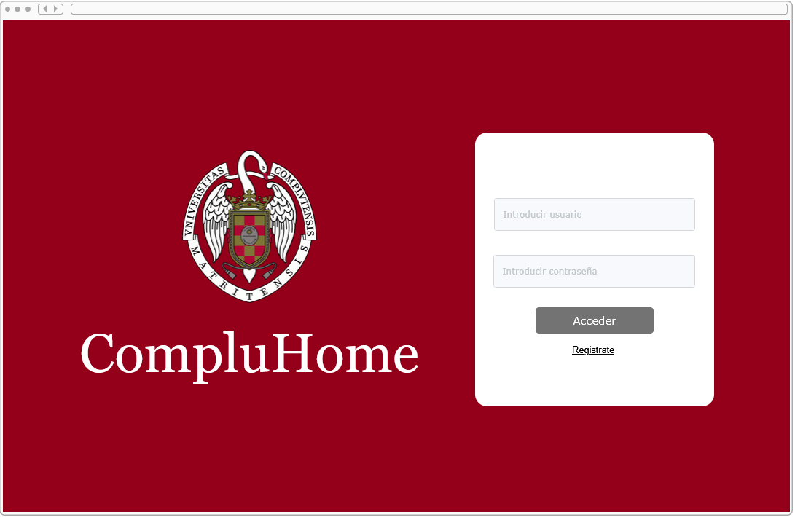
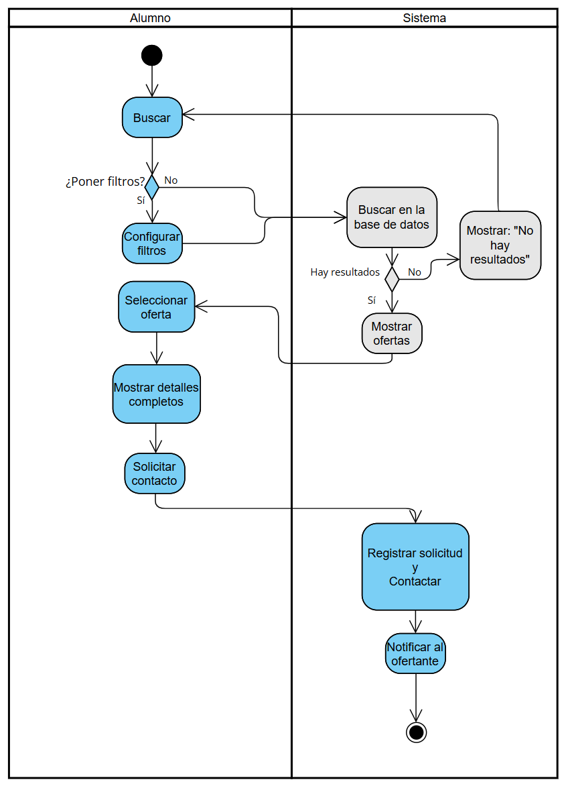
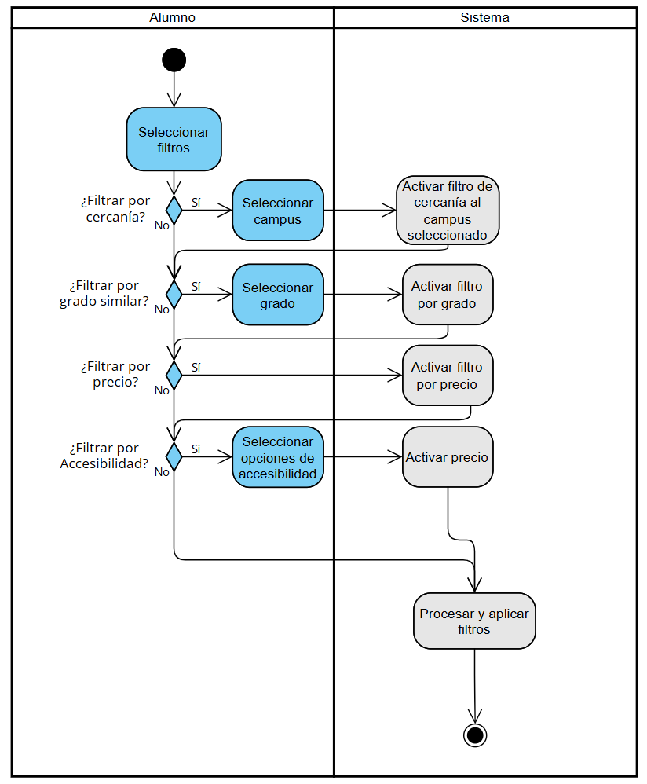
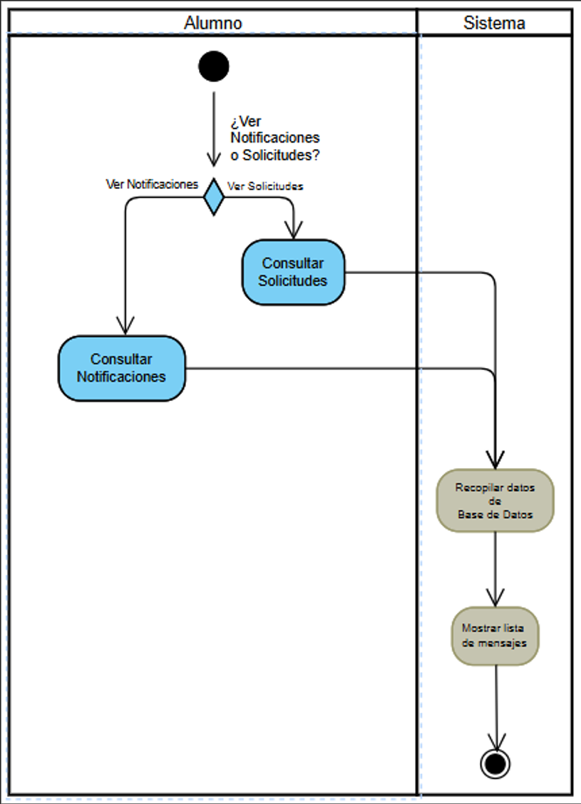
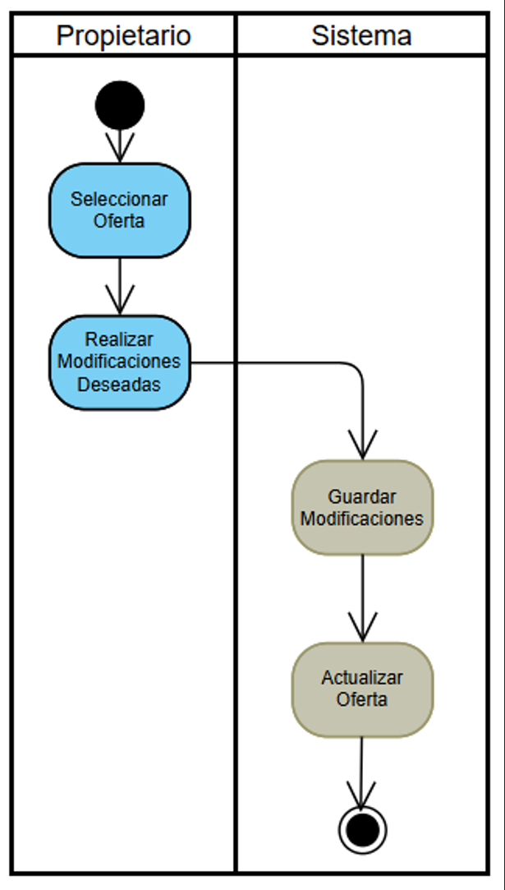
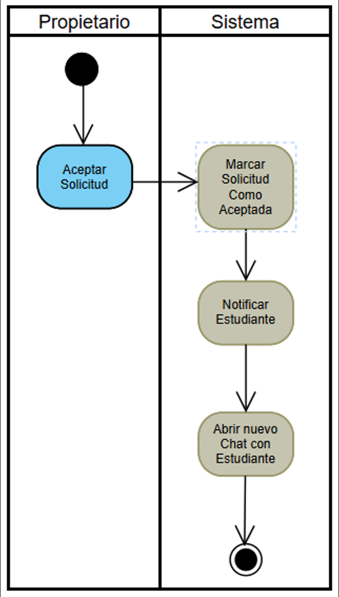
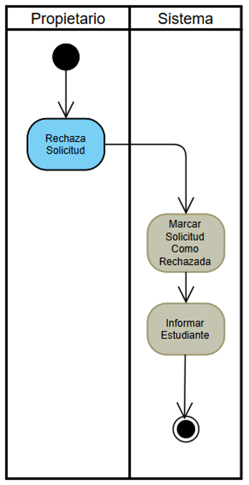

# 6\. Arquitectura y Diseño del Sistema

## Diagrama general de arquitectura
Texto de ejemplo…

## Definición de subsistemas

### \-Diagramas de Casos de Uso
Texto de ejemplo…

### \-Casos de uso especificados
Texto de ejemplo…

### \-Diagramas de actividad
Texto de ejemplo…

### \-Prototipado de la herramienta por subsistema
Texto de ejemplo…  

# Apartados
- [ ] Diagrama general de arquitectura
- [ ] Def por subsistema
	- [ ] Diag casos de uso espe
	- [ ] Cass de uuso especif
	- [ ] Diagrama de actividad
	- [ ] Prototipos/ Interfaz

# Interfaces
## Login/Registro
Misma pantalla para todos ls usuarios
Si el usuario utiliza cuennta ucm, se redirige cmoo estudinte y la autenficicación se asegura a traves de la UCM.
Los Ofertantes, deberán entrar con usuaris especificamnte verificads.
Admins van a parte, listra reservada

## Pág principal (diferent dep dl usuario)
### Estudiantes
Pagina rollo immobiliaria, una barra de busqueda con filtros (cercania campus, Grados(estudiantes dee la mmisma carrera), precio, opciones accesibilidad)
Luego un gran dropdoown de "Ofertas"
Las Ofertas tendran un aspcto. 
>[!Note]
>Las ofertas no son habitacionewes asiladas,, sino modelos dentro de un blque, en la ofertta se muestra cuantas eesatn libres/del total

- Posibles incorporaciones
	- Comunicación a traves de la pagina (chat)
	- Pago a  traves de la pagina (mismo servicio qu epago matricula?)
## Pag Dtallada de oferta
Ofrece ya si toda la informacion y mas fotos, video ... de la habitación
Informacion del sitio y info de contacto del propietario. Aparte de esto, igual una opcion para mandarle un correo d inteeresado directamente desde la app con correo UCM.

## Pag de Notificaciones
Pag alternativa, accesoo por barra superor boton.
Notificacines de alerta de ofertas neuvas por zona. 
Si te subscribees a un bloque de habitaciones, por cer4cania o conveniencia, notif si queda alguno nuevo libre o se va un estudiante y cede la hab.
Enn caso de denegación, si otro usuario coge el piso o cuslwuirt cosa.
Y esta visualmeente rollo correeo o Popup (con notificiacionese rollo campanita).
## Pag de Ajustes/ menu lateeral
- accesibilidad
- Idioma
- Personalizacion tema...

## Pag principal de Ofertantee
Similar a la dee estudiante, con tus ofertas rollo DashBoard. 
Panel notificaciones enetreantes y opciones para adinistrar las ofertas que trienes subidas (tanto mmodificar, eliminar o añadir habitacioonees).

Filtro por los tipos de habitacion que oferta
Y un dashbard con todas lass salas de ste tipo. Si estan ocupadas, sino, desde cuando, permanencia.. Flow base de datos.
### Notifciaciones
Ntifciaciones entrantes de estudiantres mandando oferta.Opciones del estilo de rechazar o contactar.
Psible esquema de colores:
- Verde hab libre
- Roo hab ocupada
- Ammarllo? hab pendiente de concretar si se ocupa (reservada).

# Subsistemas
Control Usario/Registro
Busqueda 
Mensajeria/Notificaciones
Base de dattos (las ofertas)
## Busqueda
### Caso Uso: Estudiante busca y solicita oferta
Login, pag prin, acceso filtros, mirar oferta, abrir descipcion oferta, contactar
### Diagrama de actividad
### Protootipo
## Notificaciones
### Ofertante acepta y gestiona ofertas
Lgin, pag dashboard, acceso nootificacioones, seleccin notificacion entrante, aceptar (see manda la forma de contacto externo), pasaria la habitacion a "Amarilloo".
### Diagrama de actividad
### Prototipo
# Interfaces

Nuestra aplicación cuenta con una serie de interfaces que facilitan la experiencia de usuario (UX). Estas interfaces están interconectadas entre sí, y dependiendo del caso de uso, será necesario navegar entre ellas. Cada una de estas interfaces está diseñada para ofrecer la mejor experiencia posible según el rol del usuario, ya sea estudiante o propietario. A continuación, se describen las principales interfaces que forman parte de la aplicación.
## Interfaz de Inicio
Esta es la interfaz inicial que ve todo usuario al abrir nuestra aplicación. Su función principal es verificar los datos de registro del usuario y, en caso de ser un usuario registrado, permitirle el acceso.

### Descripción
La interfaz cuenta con un sencillo inicio de sesión, pidiendo al usuario que introduzca su correo y contraseña. Se pueden distinguir dos tipos de usuario al iniciar sesión:
- **Estudiantes**: Cuentan con un correo universitario verificado.
- **Propietarios**: Necesitan haber creado una cuenta previamente, habiendo llegado a un acuerdo con la universidad en cuestión.
En el caso de que un estudiante no tenga una cuenta registrada, deberá introducir su correo y seleccionar la opción de *registrarse*, lo que enviará un correo a su dirección académica para verificar su registro. Una vez introducidos los datos correctos, dependiendo de si se trata de un correo universitario o de propietario, el usuario será redirigido a la interfaz que le corresponda. 
- Los estudiantes serán dirigidos a la interfaz de Búsqueda de piso.
- Los propietarios serán dirigidos a la interfaz de Propietarios.
### Casos de uso
Esta es una lista de los casos de uso desarrollados en esta interfaz:
- Registro de Usuario.
- Inicio de Sesión.
- Verificación de los datos mediante la UCM.

## Interfaz Principal
La interfaz principal solo puede ser accedida por los estudiantes registrados en la aplicación. Esta interfaz muestra la oferta de habitaciones disponibles.

### Descripción
La interfaz cuenta con una barra superior donde encontramos un icono de notificaciones a la izquierda, y un icono de usuario a la derecha. El icono de notificaciones muestra una lista de las notificaciones entrantes para el usuario. Estas pueden ser la aceptación o denegación de una habitación o la aparición de nuevas habitaciones en la aplicación. 
El icono de usuario muestra un menú donde se pueden seleccionar distintas opciones de accesibilidad o cerrar sesión. 

Bajo la barra superior, encontramos la sección de búsqueda. Esta cuenta con una barra de búsqueda por nombre y un menú seleccionador de filtros, entre los que encontramos: 
- Filtros por campus o zona de la habitación.
- Precios máximos y mínimos por habitación.
- Opciones de accesibilidad como ascensores o transporte público cercano.
- Filtro por carreras, seleccionando habitaciones en edificios donde se hospedan estudiantes de la carrera del usuario.
Los filtros seleccionados se muestran a la derecha, en píldoras, con un botón para eliminar el filtro. 

El resto de la interfaz contiene las ofertas resultantes tras aplicar los filtros seleccionados. Estas habitaciones se muestran con fotos, una breve descripción de la oferta y un "iframe" con la ubicación de la habitación en un mapa. 
Al hacer clic en una de estas ofertas, se abrirá una vista más detallada de la respectiva habitación, la Interfaz detallada.
### Casos de uso
Esta es una lista de los casos de uso desarrollados en esta interfaz:
- Buscar oferta.
- Filtrar ofertas mediante los filtros mencionados.
- Ajustes de cuenta
- Cerrar sesión
- Visualizar notificaciones

## Interfaz Detallada
La interfaz detallada ofrece toda la información relativa a una habitación ofertada. Es desde esta interfaz desde la que un estudiante, en caso de interesarse por una habitación, puede ponerse en contacto con el propietario.

### Descripción
Esta interfaz se puede dividir en tres apartados principales:
1. **Carrusel de imágenes**: El primer apartado es un carrusel con fotografías de la habitación, el edificio donde se encuentra y sus instalaciones.
2. **Descripción detallada**: La segunda sección contiene una serie de párrafos donde se describe en detalle la oferta, incluyendo tanto las características físicas de la habitación y los utensilios o electrodomésticos con los que está equipada, como los servicios externos disponibles. Entre estos servicios se encuentran la lavandería o un servicio de cantina para estudiantes entre semana. También se incluye un mapa para ver la ubicación precisa del edificio y su cercanía al campus.
3. **Precio y contacto**: Por último, en la parte inferior se encuentra la sección con el precio del alquiler, que ha sido previamente verificado y ajustado por la universidad, y un método de contacto con el propietario de la habitación. Este último puede recibir un mensaje con nuestro interés al hacer clic en el botón en la parte inferior de la página.
>[!note]
>En caso de que ya haya una oferta de otro estudiante por la habitación, se incluiría una opción de suscripción a la habitación, que notificará al estudiante en caso de que esa oferta anterior sea rechazada.
### Casos de Uso
Esta es una lista de los casos de uso desarrollados en esta interfaz:
- Visualizar detalles de una oferta.
- Contactar con el propietario de la habitación.
- Suscribirse a una alerta para la habitación.

## Interfaz Propietario
La interfaz de propietario es la que acceden los propietarios una vez han sido verificados al iniciar sesión. Su objetivo principal es la gestión y visualización de las habitaciones que el propietario tiene ofertadas en la aplicación.

### Detalles
Esta interfaz cuenta con el mismo menú superior que la interfaz principal de los estudiantes, lo que permite acceder a las notificaciones entrantes, cambiar los ajustes de la cuenta y cerrar sesión.
La parte principal de la interfaz tiene un formato de *Dashboard*, que muestra una tabla con todas las habitaciones que el propietario tiene ofertadas en la aplicación.
También se incluyen opciones de filtro para seleccionar qué información se muestra en cada fila de la tabla, así como la posibilidad de ordenar las habitaciones según diferentes criterios.
Para cada habitación se muestra su nombre y su estado de ocupación. Las habitaciones pueden estar:
- **Libres**: Si nadie está alquilándola actualmente.
- **Ocupadas**: Si un estudiante está residiendo en ella.
- **En trámite**: Si la habitación está en proceso de ser alquilada.
Si el propietario selecciona cualquiera de las filas, se mostrará una vista detallada.
Los propietarios también pueden eliminar, modificar o añadir nuevas ofertas desde esta interfaz.
###  Casos de Uso
Esta es una lista de los casos de uso desarrollados en esta interfaz
- Ver información de las habitaciones y los residentes.
- Añadir o modificar una oferta.
- Gestionar solicitudes mediante las notificaciones.
- 
# Casos De uso

Hay que realizar 18 casos de uso para el documento, que cada uno escoja 2.
- [x] Registrarse (Héctor)
- [x] Iniciar sesión (Alex)
- [x] Cerrar sesión  (Alex)
- [ ] Cambiar ajustes app (Habría que definir qué se hace en este)
- [x] interesarse por oferta (Alumno) (cuando esté en medio de un tramite y no se puede solicitar, se interesa activando una suscripcion de alerta en la hab y mandara una notif si esta está disponible) (Héctor)
- [x] Ver mensajes de solicitudes-notificaciones (Alumno) (Senbo)
- [ ] Abrir localización habitacion en Maps o equivalente (por el iframe)
- [x] Buscar y solicitar oferta (Alumno) (Hugo)
- [x] filtrar ofertas por "insertar filtro" (Hugo)
- [x] Publicar oferta (Viñas)
- [x] Eliminar oferta (Viñas)
- [x] Modificar oferta vigente (Propietario) (Senbo)
- [x] ver info de las habitaciones (Propietario) (Alex)
- [x] Aceptar solicitud estudiante y comenzar conversación (Propietario) (Senbo)
- [x] rechazar estudiante (Propietario) (Senbo)
- [ ] Añadir oferta a una lista de favoritos (Alumno) (Axel)
- [ ] Solicitar quedada con el propietario para ver la oferta (Alumno) (Axel)

### 17. Especificación del Caso de uso: Solicitar quedada con el propietario para ver la oferta
	Identificador: CU-03
	Nombre: Solicitar quedada con el propietario para ver la oferta
	Actores:
 		● Actor Principal: Alumno UCM.
 		● Actor Secundario: Sistema (Base de Datos).

	Descripción:
	El alumno UCM envía una solicitud al propietario de una oferta de alojamiento para concertar una cita presencial o virtual y visualizar la vivienda. La solicitud incluye una fecha y hora propuestas, así como un mensaje opcional.

	Precondiciones:
 	
 		- El usuario debe estar visualizando una oferta de alojamiento válida y disponible.
 	- El propietario de la oferta debe tener su perfil activo y accesible.

	Postcondiciones:
 		- La solicitud de quedada queda registrada en la base de datos, asociada al alumno, al propietario y a la oferta.
 		- El sistema notifica al propietario de la nueva solicitud (por ejemplo, mediante mensaje interno o alerta en la plataforma).

### 1. Especificación del Caso de Uso : Buscar y solicitar oferta.
	Identificador: CU-01 (o el número que toque)
	Nombre: Buscar y Solicitar Oferta de Alojamiento
	Actores:
		● Actor Principal: Alumno UCM.
		● Actor Secundario: Sistema (Base de Datos).
	Descripción: El alumno busca alojamiento utilizando filtros específicos, consulta los
		detalles de una vivienda y contacta con el ofertante para mostrar interés.
	Precondiciones:
		El usuario necesita haber iniciado sesión.
	Postcondiciones:
		La oferta queda marcada como "Con solicitud pendiente" para ese usuario.
		El Ofertante tiene una nueva notificación en su dashboard.

### 2. Especificación del Caso de Uso : Filtrar búsqueda.
	Identificador: CU-02 (o el número que toque)
	Nombre: Configurar filtros de búsqueda
	Actores:
		● Actor Principal: Alumno UCM.
		● Actor Secundario: Sistema (Base de Datos).
	Descripción: El alumno configura las opciones de filtrado en la búsqueda de habitaciones, pudiendo filtrar por cercanía a un campus seleccionado, por similitud del grado universitario de los residentes al grado seleccionado, por precio y por opciones de accesibilidad.
	Precondiciones:
		El usuario necesita haber iniciado sesión.
		El usuario debe haber comenzado la búsqueda de habitaciones.
	Postcondiciones:
		Los filtros configurados deben estar procesados y aplicados correctamente.
		Se debe proceder con la ejecución de la búsqueda.

## 3. Especificación del Caso de Uso : Añadir oferta de Habitación
	Identificador: CU-01 (o el número que toque)
	Nombre: Añadir nueva oferta de Habitación.
	Actores:
		● Actor Principal: Propietario de la Habitación.
		● Actor Secundario: Sistema (Base de Datos).
	Descripción: El propietario tiene una habitación que quiere subir a la plataforma y añade una oferta para esta misma a la aplicación. La nueva habitación se mostrará para todos los estudiantes en la aplicación.
	Precondiciones:
		El usuario necesita haber iniciado sesión.
	Postcondiciones:
		El propietario tiene una nueva habitación ofertada bajo su perfil.
		El propietario recibe una notificación indicando si se ha añadido la habitación a la BD con éxito.
		
###  Diagrama actividad:
![[./Imagenes/CU_AddHabitación.png]]

## 4. Especificación del Caso de Uso : Eliminar habitación
	Identificador: CU-01 (o el número que toque)
	Nombre: Añadir nueva oferta de Habitación.
	Actores:
		● Actor Principal: Propietario de la Habitación.
		● Actor Secundario: Sistema (Base de Datos).
	Descripción: El propietario selecciona una de sus habitaciones subidas a la aplicación y la selecciona para eliminarla de la Base de Datos. La oferta de la habitación deja de estar disponible para los estudiantes de la plataforma. 
	Precondiciones:
		El usuario necesita haber iniciado sesión.
	Postcondiciones:
		El propietario elimina la habitación seleccionada de su perfil.
		El propietario recibe una notificación indicando que se ha eliminado con éxito la habitación
		Los alumnos interesados en la habitación reciben una notificación indicando que ya no está disponible.
	
###  Diagrama actividad:
![[./Imagenes/CU_DelHabitación.png]]

### 5. Especificación del Caso de Uso : Ver Información de las Habitaciones.
	Identificador: CU-XX 
	Nombre: Ver información de las habitaciones (Propietario).
	Actores:
		● Actor Principal: Propietario de la Habitación.
		● Actor Secundario: Sistema (Base de Datos).
	Descripción: El Propietario accede a un menú específico y conectado a la Base de Datos en el que se muestran sus propiedades (Habitaciones). Para cada una de ellas se despliegan los datos pertinentes.
	Precondiciones:
		El Propietario debe haber iniciado sesión.
		Las Habitaciones deben estar registradas en la base de datos.
	Postcondiciones:
		Las Habitaciones quedan cargadas y mostrando datos importantes (disponibilidad, estudiante/s ocupándola, link a la descarga del contrato… )

		###  Diagrama actividad:

### 6. Especificación del Caso de Uso : Inicio de Sesión.
	Identificador: CU-XX 
	Nombre: Iniciar Sesión.
	Actores:
		● Actor Principal: Usuario del Sistema (Administrador, Estudiante o Arrendador).
		● Actor Secundario: Sistema (Base de Datos).
	Descripción: Un Usuario accede a la página principal de inicio de sesión. Se contrasta los datos con la Base de Datos y en caso de éxito se otorga acceso a la     plataforma.
	Precondiciones:
		El Usuario debe tener una cuenta.
	Postcondiciones:
		La página queda accesible en caso de que haya iniciado sesión.

		###  Diagrama actividad:

### 7. Especificación del Caso de Uso : Cierre de Sesión.
	Identificador: CU-XX 
	Nombre: Cerrar sesión
	Actores:
		● Actor Principal: Usuario del Sistema (Administrador, Estudiante o Arrendador).
		● Actor Secundario: Sistema (Base de Datos).
	Descripción:Un Usuario accede a la opción de cierre de sesión. Se pregunta si quiere recordar la contraseña para un inicio de sesión futuro. En todo caso se       sale de la página.
	Precondiciones:
		El Usuario debe haber iniciado sesión.
	Postcondiciones:
		El Usuario sale de la página y la sesión queda correctamente cerrada.

		###  Diagrama actividad:

### 8. Ver mensajes de solicitudes-notificaciones (Alumno)
	Identificador: CU-XX
	Nombre: Ver mensajes de solicitudes-notificaciones (Alumno).
	Actores:
		● Actor Principal: Alumno UCM.
		● Actor Secundario: Sistema (Base de Datos).
	Descripción: El alumno consulta los mensajes de solicitudes propios.
	Precondiciones:
		El usuario necesita haber iniciado sesión.
	Postcondiciones:
		Se le muestra la lista de solicitudes al usuario.

### 9. Modificar oferta vigente (Propietario).
	Identificador: CU-XX
	Nombre: Modificar oferta vigente (Propietario).
	Actores:
		● Actor Principal: Propietario.
		● Actor Secundario: Sistema (Base de Datos).
	Descripción: El alumno consulta los mensajes de solicitudes propios.
	Precondiciones:
		El usuario necesita haber iniciado sesión.
		El usuario debe tener al menos una oferta vigente
	Postcondiciones:
		Se modifica la oferta vigente.

### 10. Aceptar solicitud estudiante y comenzar conversación (Propietario)
	Identificador: CU-XX
	Nombre: Aceptar solicitud estudiante y comenzar conversación (Propietario)
	Actores:
		● Actor Principal: Propietario.
		● Actor Secundario: Sistema (Base de Datos).
	Descripción: El alumno consulta los mensajes de solicitudes propios.
	Precondiciones:
		El usuario necesita haber iniciado sesión.
		El usuario debe tener una solicitud vigente.
	Postcondiciones:
		La solicitud queda como aceptada.
		El estudiante es informado de la aceptación.

### 11. Rechazar estudiante (Propietario)
	Identificador: CU-XX
	Nombre: Rechazar estudiante (Propietario).
	Actores:
		● Actor Principal: Propietario.
		● Actor Secundario: Sistema (Base de Datos).
	Descripción: El alumno consulta los mensajes de solicitudes propios.
	Precondiciones:
		El usuario necesita haber iniciado sesión.
		El usuario debe tener una solicitud vigente
	Postcondiciones:
		La solicitud queda como rechazada.
		El estudiante es informado del rechazo.

### 12. Especificación del Caso de Uso : Registrarse.
	Identificador: CU-XX
	Nombre: Registro de Usuario en la Plataforma
	Actores:
		● Actor Principal: Alumno UCM.
		● Actor Secundario: Sistema (Base de Datos).
	Descripción: El alumno accede al formulario de registro y proporciona sus datos personales y credenciales iniciales. El sistema valida la información introducida, comprueba si el correo cumple los requisitos 	establecidos (correo institucional UCM en el caso de estudiantes) y almacena los datos en la base de datos. Una vez registrado, se envía un correo de verificación al usuario y su cuenta queda pendiente de 		activación según su rol.
	Precondiciones:
		El alumno no debe existir previamente en el sistema.
	Postcondiciones:
		El alumno queda registrado en la base de datos con su rol correspondiente.
		Se genera y envía un correo de validación al usuario para completar el proceso.
		En caso de ser una inmobiliaria/propietario, su cuenta queda en estado "Pendiente de aprobación".

### 13. Especificación del Caso de Uso : Registrarse.
	Identificador: CU-XX
	Nombre: Interesarse por una Oferta de Alojamiento
	Actores:
		● Actor Principal: Alumno UCM.
		● Actor Secundario: Sistema (Base de Datos).
	Descripción: El alumno, mientras visualiza la ficha de una habitación que actualmente no permite enviar una solicitud directa (por encontrarse en trámite o temporalmente no disponible), puede indicar su interés 	activando una suscripción de alerta. El sistema registra dicho interés en la base de datos y monitoriza el estado de la habitación. Cuando la oferta vuelva a estar disponible, el sistema enviará automáticamente 	una notificación al alumno para informarle de que ya puede solicitarla.
	Precondiciones:
		El alumno debe haber iniciado sesión.
		La oferta debe encontrarse no disponible para solicitud, pero visible en el sistema.
	Postcondiciones:
		La habitación queda asociada al alumno como “Interés activado”.
		El sistema registra una suscripción de alerta para esa habitación.	
		El alumno recibirá una notificación automática cuando la oferta pase a estado disponible.

### 16. Especificación del caso de Uso: Añadir oferta a una lista de favoritos
	Identificador: CU-16 (o el que toque)
	Nombre: Añadir oferta a una lista de favoritos
	Actores:
		● Actor Principal: Alumno UCM.
		● Actor Secundario: Sistema (Base de Datos).

	Descripción: El alumno UCM añade una oferta de alojamiento a su lista personal de favoritos para poder acceder a ella de forma rápida en futuras sesiones  
	Precondiciones:
		El usuario debe haber iniciado sesión en la app
		El usuario debe estar mirando una oferta de alojamiento y que seá válida y disponible.

	Postcondiciones:
		La oferta seleccionada queda registrada en la lista de favoritos del alumno en la base de datos
		El sistema actualiza la interfaz para reflejar visualmente que la oferta ha sido marcada como favorita.

